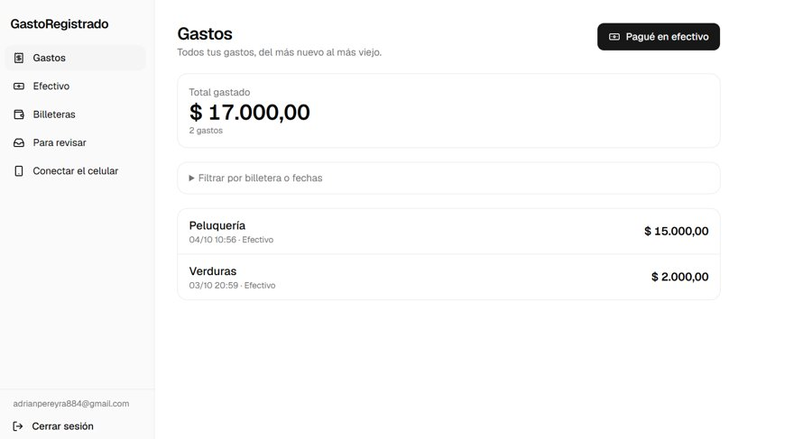
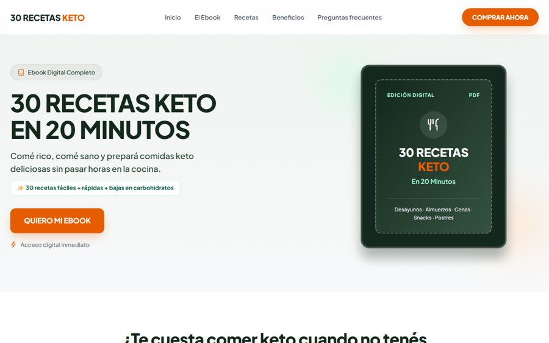
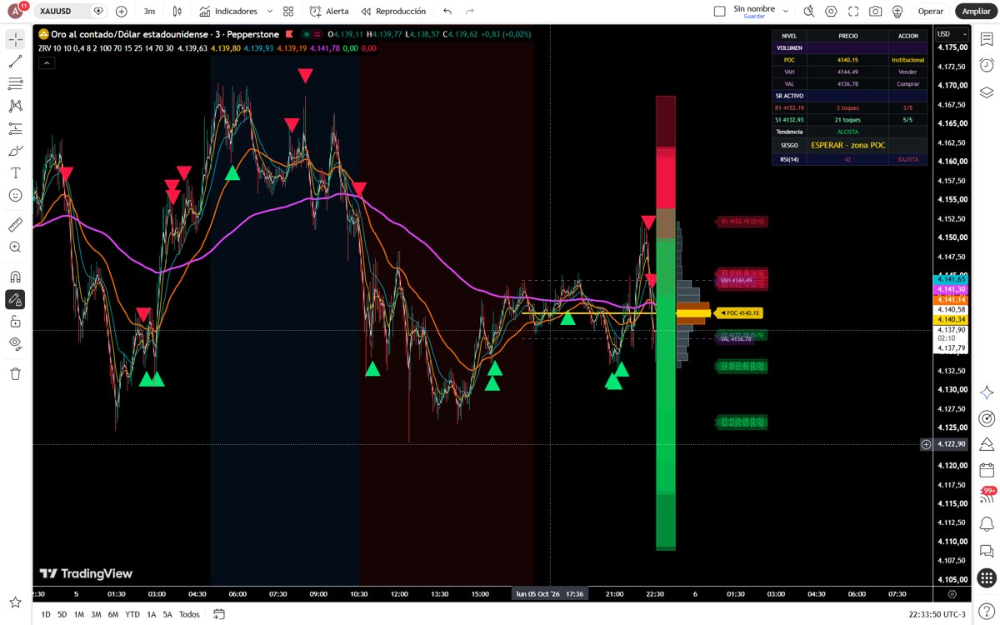

# Adrián Pereyra

Desarrollador de software web | Python + IA | Ecommerce y plataformas propias | Marketing digital y redes

Desarrollo **páginas web y herramientas con Python e inteligencia artificial**: de la idea a un sitio funcionando en internet. También hago **creación y soporte de marketing digital y redes**: páginas de Facebook e Instagram, imágenes, textos y videos para publicidad.

Mendoza, Argentina · [Mi página](https://adrian884hub.github.io/)

---

## Proyecto destacado: MenduEbook

[](https://mendumarket.com.ar)

**Plataforma que crea con IA un ebook completo en PDF y su página de venta, listos para vender.** El cliente escribe un tema y en minutos recibe el libro diseñado (guía, recetario o libro para colorear), la landing de venta y las instrucciones para publicarla. Cobra con Mercado Pago, tiene panel de administración, traduce a otros idiomas y corre en un servidor propio. Ya generó más de 60 libros.

**Python · Flask · API de Claude · API de OpenAI · SQLite · Mercado Pago · Login con Google · Servidor Ubuntu**

[Ver el sitio](https://mendumarket.com.ar) · [Ver capturas, ejemplos y código](https://github.com/adrian884hub/mendu-market-portfolio)

---

## Otros proyectos

### GastoRegistrado: libreta automática de gastos


App web que registra sola las compras y pagos de todas las billeteras virtuales, leyendo las notificaciones del celular, y los muestra en una sola lista con fecha, importe, comercio y billetera. Se instala en el celular como app.

**Next.js · TypeScript · Supabase (PostgreSQL) · Tailwind CSS · Vitest · Vercel** · *Código privado (tiene datos personales). Un extracto real: la parte que lee el importe de cualquier notificación.*

```ts
// "$ 1.000", "$400", "$ 300,00", "US$ 20", "U$S 20"
const IMPORTE = /(US\$|U\$S|USD|\$)\s?(\d{1,3}(?:\.\d{3})+(?:,\d{1,2})?|\d+(?:[.,]\d{1,2})?)/i;

export type TipoLectura =
  | "gasto"        // plata que sale hacia otra persona o comercio
  | "propia"       // envío entre mis propias billeteras: no es gasto
  | "entrada"      // plata que entra
  | "dudosa"       // tiene importe pero no se sabe si entra o sale
  | "sin_importe"; // promociones y avisos: se ignora
```

### Restaurante Los Olivos: sitio web para un negocio gastronómico
[](https://adrian884hub.github.io/restaurante-los-olivos/)

Página de muestra para un restaurante de Mendoza: carrusel de fotos, menú por pestañas, reservas que llegan por WhatsApp y diseño para celular. Incluye casos de prueba y reporte de errores (QA).

**HTML · CSS · JavaScript** · [Ver la página](https://adrian884hub.github.io/restaurante-los-olivos/) · [Código](https://github.com/adrian884hub/restaurante-los-olivos)

### 30 Recetas Keto: landing de venta de un ebook
[](https://adrian884hub.github.io/recetas-keto/)

Página de venta para un ebook de recetas, pensada para convertir visitas en compras.

**HTML · CSS · JavaScript** · [Ver la página](https://adrian884hub.github.io/recetas-keto/) · [Código](https://github.com/adrian884hub/recetas-keto)

### Centro de ayuda de Mendu Market
[](https://adrian884hub.github.io/faq-mendumarket./)

Preguntas frecuentes sobre pagos, envíos y cambios para la tienda online Mendu Market, con contacto por WhatsApp.

**HTML · CSS · JavaScript** · [Ver la página](https://adrian884hub.github.io/faq-mendumarket./) · [Código](https://github.com/adrian884hub/faq-mendumarket.)

### Indicadores para TradingView


Dos indicadores de análisis técnico en Pine Script: detección automática de soportes y resistencias con puntaje, perfil de volumen, señales de compra y venta por confluencia, Stop Loss y Take Profit automáticos y mapa de calor de precios.

**Pine Script v5** · [Zonas Rebote + Volumen](https://github.com/adrian884hub/indicador-zonas-rebote-volumen) · [SR Confluencia + Mapa de Calor](https://github.com/adrian884hub/indicadores-tradingview-1-)

### Game Booster: limpiador y optimizador de PC


Programa de escritorio que optimiza la PC para jugar: limpia archivos temporales, cierra procesos en segundo plano y libera memoria con un solo botón.

**Python · Tkinter · PyInstaller** · [Código](https://github.com/adrian884hub/game-booster)

---

## Qué hago

- Sitios web y páginas de venta
- Plataformas con cobros online (Mercado Pago)
- Herramientas y automatizaciones en Python
- Integraciones con inteligencia artificial (Claude, OpenAI)
- Creación y soporte de marketing digital y redes
- Indicadores para TradingView (Pine Script)

## Contacto

**Disponible para proyectos y trabajos.** Escribime y lo charlamos.

- Email: [adrianpereyra884@gmail.com](mailto:adrianpereyra884@gmail.com)
- WhatsApp: [+54 261 637-3263](https://wa.me/542616373263)
